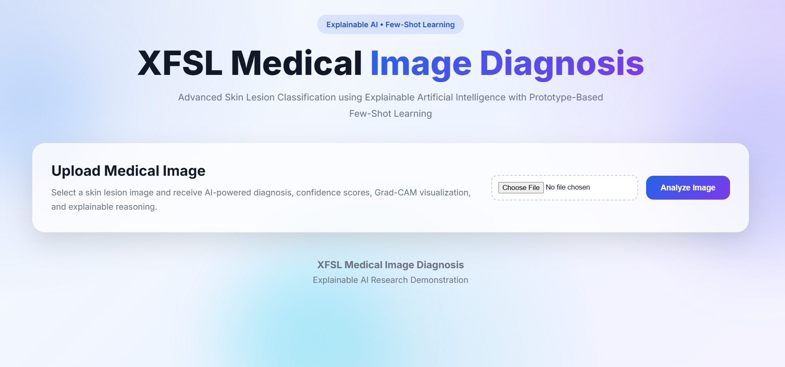
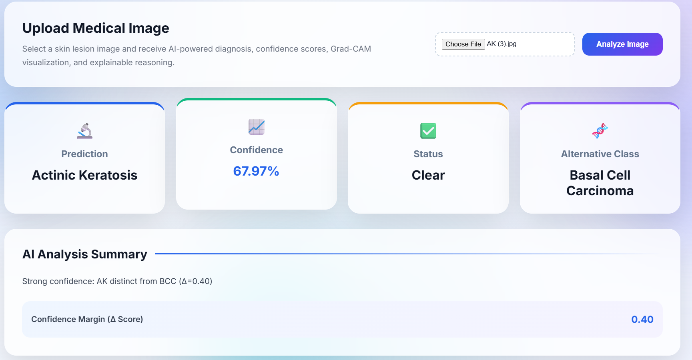
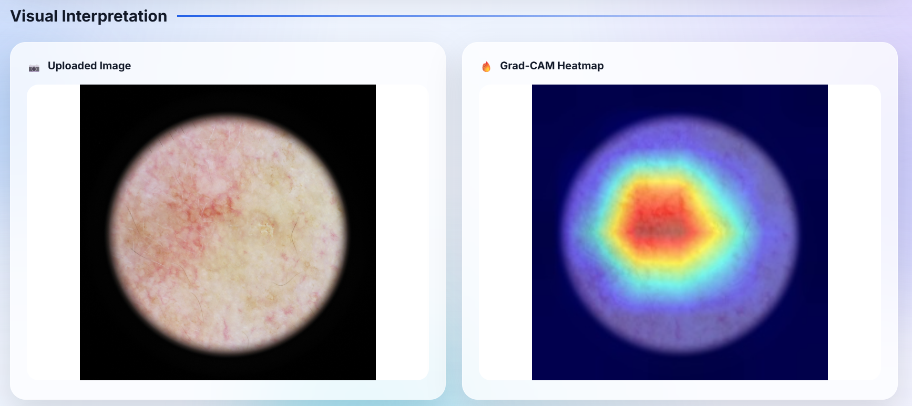
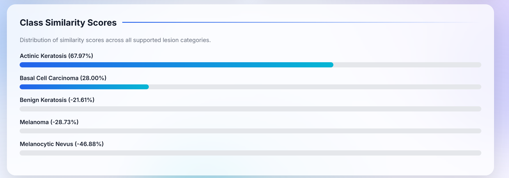
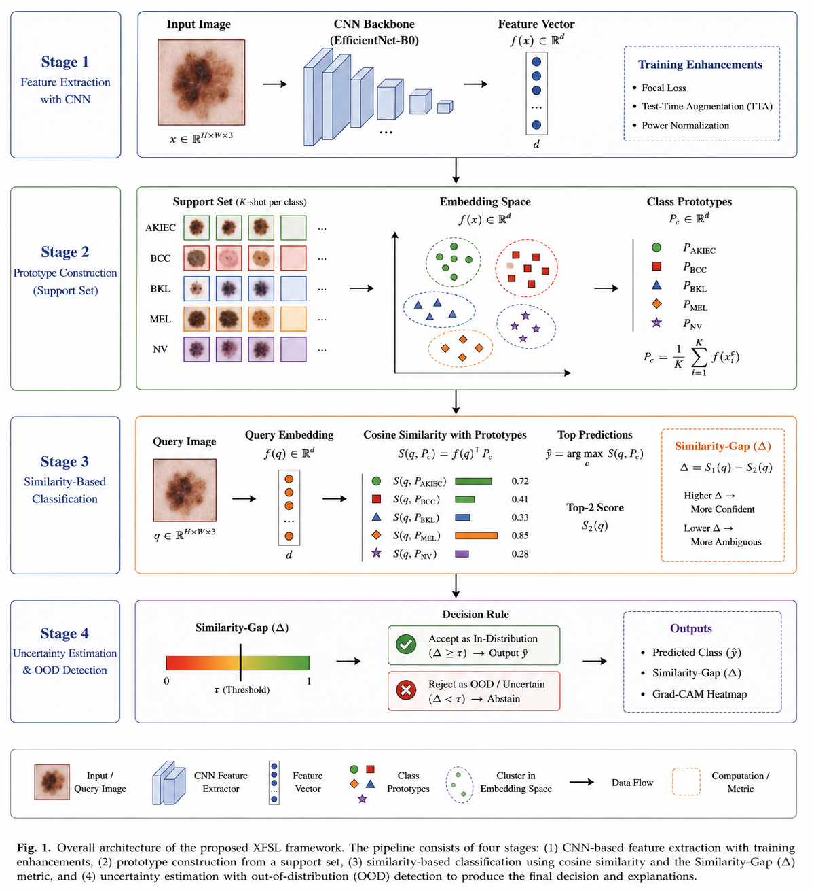
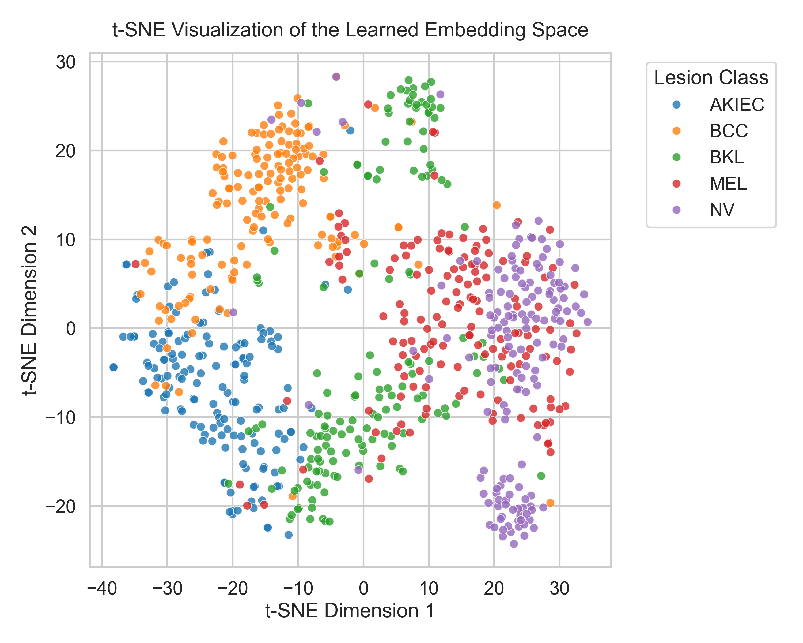

# XFSL Medical AI

### Explainable Few-Shot Learning Framework for Skin Lesion Analysis and Clinical Decision Support

[]()
[]()
[]()
[]()

An Explainable Few-Shot Learning (XFSL) framework for medical image diagnosis that combines prototype-based classification, uncertainty-aware reasoning, Out-of-Distribution (OOD) detection, and Grad-CAM explainability into a unified clinical decision-support system.

Unlike traditional deep learning models that operate as black boxes and require large-scale labeled datasets, XFSL is designed for low-data medical imaging environments while maintaining interpretability and safety-aware prediction behavior.

---

## Live Demo

Web Application:
https://huggingface.co/spaces/ashishyadav23/xfsl-medical-ai-web

Project Website:
https://ashishyadav18.github.io/XFSL-Medical-Image-Diagnosis/

---

# Dashboard Preview

### Home Interface



### Prediction Results





###

---

# Project Overview

The proposed XFSL framework integrates:

* EfficientNet-B0 feature extraction
* Prototype-Based Few-Shot Learning
* Similarity-Gap (Δ) uncertainty estimation
* Out-of-Distribution (OOD) rejection
* Grad-CAM explainability
* Test-Time Augmentation (TTA)
* Power Normalization

The framework was developed as part of a research dissertation focused on improving transparency, reliability, and safety in AI-assisted medical image diagnosis.

---

# Key Features

## Explainable AI

Generate Grad-CAM visual explanations highlighting lesion regions that influence model predictions.

## Prototype-Based Classification

Classify images using learned class prototypes instead of traditional probability-based classification.

## Similarity-Gap (Δ) Reasoning

Quantify diagnostic ambiguity by measuring the separation between top competing class predictions.

## OOD Detection

Automatically reject unfamiliar or out-of-distribution samples using cosine similarity thresholding.

## Few-Shot Learning

Operate effectively under limited-data conditions without requiring large-scale annotation efforts.

## Lightweight Architecture

Built using EfficientNet-B0 with a computationally efficient prototype-based inference pipeline.

---

# System Architecture



The inference pipeline consists of four major stages:

```text
Input Image
      ↓
EfficientNet-B0 Feature Extraction
      ↓
Prototype-Based Similarity Matching
      ↓
Uncertainty Estimation (Δ)
      ↓
OOD Detection
      ↓
Grad-CAM Explainability
      ↓
Final Clinical Prediction
```

---

# Research Contributions

### Explainable Few-Shot Learning Framework

A lightweight XFSL architecture that combines prototype-based classification with interpretable uncertainty reasoning.

### Similarity-Gap (Δ) Metric

A mathematically transparent uncertainty estimation mechanism that measures ambiguity directly within feature space.

### OOD Safety Layer

An automated rejection mechanism capable of identifying unfamiliar medical and non-medical inputs.

### Embedding Stabilization

Integration of Test-Time Augmentation (TTA) and Power Normalization to improve feature-space robustness.

### Clinically Conservative Decision Behavior

The framework naturally prioritizes malignant lesion recall over benign precision, aligning with clinical safety considerations.

---

# Experimental Results

## CNN Backbone Performance

| Metric              | Value  |
| ------------------- | ------ |
| Training Accuracy   | 83.23% |
| Validation Accuracy | 81.22% |
| ROC-AUC             | 0.9511 |
| Macro F1-Score      | 0.7358 |

---

## Few-Shot Learning Performance (20-Shot)

| Metric             | Value  |
| ------------------ | ------ |
| Mean Accuracy      | 76.64% |
| Macro F1-Score     | 0.7634 |
| MCC                | 0.7105 |
| Standard Deviation | 1.23%  |

---

## OOD Detection Performance

| Threshold | Far-OOD Rejection | Near-OOD Rejection |
| --------- | ----------------- | ------------------ |
| 0.50      | 86.27%            | 68.63%             |
| 0.55      | 94.12%            | 82.35%             |
| 0.60      | 98.04%            | 96.08%             |

The selected threshold of **τ = 0.55** provides the optimal balance between diagnostic usability and safety.

---

# Feature Space Visualization



The learned embedding space demonstrates strong separation between clinically distinct lesion categories while preserving biologically meaningful overlap between visually similar classes.

---

# Repository Structure

```bash
XFSL-Medical-Image-Diagnosis/
│
├── article/
│   └── research paper
│
├── Baseline_FSLs/
│
├── deployment/
│   └── production deployment version
│
├── dataset/
│
├── train_model.py
├── main.py
├── ood_test.py
├── predict_and_explain.py
├── filter_ablation.py
│
├── plot_graphs.py
├── plot_radar.py
├── plot_tsne.py
│
├── trained_model.pth
├── saved_k20_prototypes.npy
│
├── requirements.txt
├── README.md
└── .gitignore
```

---

# Dataset

This work uses the HAM10000 / ISIC skin lesion dataset.

Due to dataset size and licensing considerations, images are not included in this repository.

Expected dataset structure:

```bash
dataset/
│
├── train/
├── test/
└── ood/
```

---

# Installation

Create a virtual environment:

```bash
python -m venv venv
```

Activate environment:

### Windows

```bash
venv\Scripts\activate
```

### Linux / macOS

```bash
source venv/bin/activate
```

Install dependencies:

```bash
pip install -r requirements.txt
```

---

# Usage

## Train CNN Backbone

```bash
python train_model.py
```

## Few-Shot Evaluation

```bash
python main.py
```

## OOD Evaluation

```bash
python ood_test.py
```

## Prediction + Explainability

```bash
python predict_and_explain.py
```

---

# Research Paper

The complete research article is available inside the `article/` directory.

**Title:**

> Explainable Prototype-Based Few-Shot Learning for Skin Lesion Classification

---

<!-- 
# Citation

If you use this work in your research, please cite:

```bibtex
@article{yadav2026xfsl,
  title={Explainable Prototype-Based Few-Shot Learning for Skin Lesion Classification},
  author={Yadav, Ashish},
  year={2026}
}
```

---
-->

# Author

**Ashish Yadav**

Artificial Intelligence • Machine Learning • Explainable AI • Medical Imaging

GitHub: https://github.com/ashishyadav18

---

### Disclaimer

This project is intended for research and educational purposes only and should not be used as a substitute for professional medical diagnosis.
